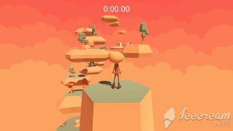
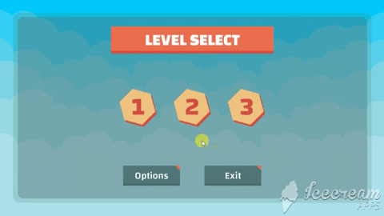
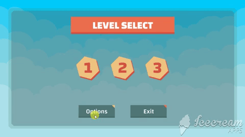
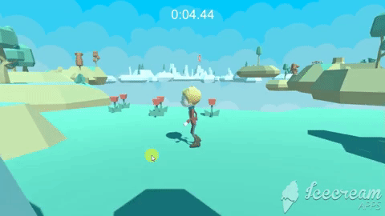
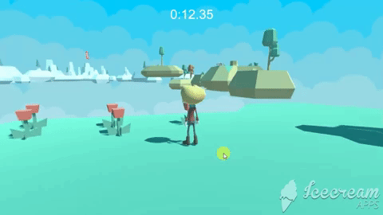
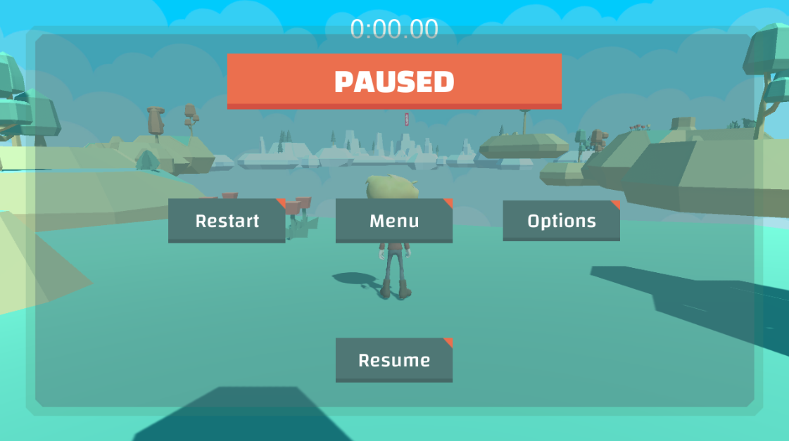
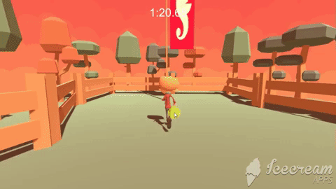

# Platformer Videogame
## Description

Platform video games, or simply platformers, are a genre of video games characterized by having to walk, run, jump or climb on a series of platforms and cliffs, with enemies, while collecting objects to complete the game. This repository contains the source code for a simple 3-level 3D platformer.  

[Play It Now](https://santiagopemo.github.io/platformer_videogame/)  

### Attributions
The realization of this project was possible, thanks to the following resources: 
* Kenney: https://kenney.nl/ 
* Oculus Audio Pack: https://developer.oculus.com/downloads/package/oculus-audio-pack-1/
* Mindful Audio: https://mindful-audio.com/
* “Wallpaper”, “Cheery Monday” Kevin MacLeod (incompetech.com)  
  Licensed under Creative Commons: By Attribution 3.0  
  http://creativecommons.org/licenses/by/3.0/

## Installation
* If you want to edit the game:  
  * Download untity from its official site https://unity3d.com/es/get-unity/download
  * Download Blender from official site https://www.blender.org/
  * Clone this repository `git clone https://github.com/santiagopemo/platformer_videogame/`
  * When you have opened the project in Unity go to file -> Build Settings -> Build

* If you only want to play, download any of the following desktop versions depending on your operating system and click on the executable
  * **[Platformer WebGL](https://santiagopemo.github.io/platformer_videogame/)**  
  * **[Platformer Linux](https://drive.google.com/file/d/1AFmC0SUztxUnFXIXbTtAMPave7cSwd67/view?usp=sharing)** 
  * **[Platformer Windows](https://drive.google.com/file/d/16qK7EBQsbgkPI6Oj15_8A6D3nZWk19Em/view?usp=sharing)**
  * **[Platformer Mac](https://drive.google.com/file/d/1x8ge4lPgs6VJ43tAdMkSnUDW-W075YFO/view?usp=sharing)**

## Usage
The game begins in the main manu where you can salect level **1**, **2** or **3**, modify your settings in the **Options** menu or **Exit**. the game  

In the Options menu you can you can change the volume of the background music, the volume of the sound effects, or invert the movement of the camera  

Once the level has started you con move the character with the **arrows keys** or with the kyes **A**, **W**, **S**, **D**, and jump with the **Space Bar**   

You can also controll the camera by holding the right click and moving the mouse  

While playing you can pause the game pressing the **Esc** key, this will popup a pause menu where you can choose any of the options

To complete each level you must collide with the sea horse flag, this will display a menu which will show the time it took to complete the level

## Author :pencil:
### Santiago Peña Mosquera  
Mechatronic engineer and student of software development in holberton school, lover of building new things from scratch, that's why my passion for programming, starting from an empty sheet and turning it into a solution for real problems.  
<a href="https://www.linkedin.com/in/santiago-pe%C3%B1a-mosquera-abaa20196/" target="_blank">LinkedIn</a>&nbsp;&nbsp;&nbsp;&nbsp;
<a href="https://twitter.com/santiagopemo" target="_blank">Twitter</a>
